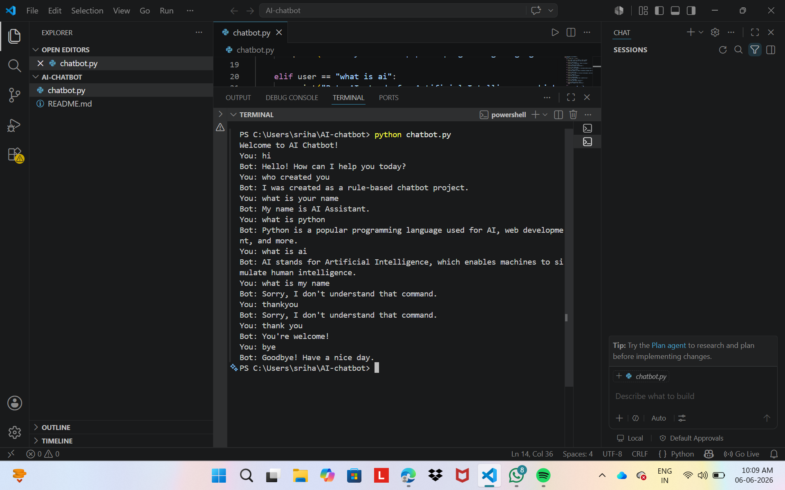

# Rule-Based AI Chatbot

## Project Overview

This is a simple rule-based AI chatbot developed using Python. The chatbot responds to predefined user inputs using if-else logic.

## Features

- Handles greetings
- Responds to basic questions
- Handles exit commands
- Rund in a continuous loop

## Technologies Used

- Python 3

## How to Run

1. Open the project folder in VS Code.
2. Open the terminal.
3. Run:
   python chatbot.py

## Sample Commands

- hi
- hello
- hey
- how are you
- who created you
- what is ai
- what is python
- good morning
- thank you
- bye

## Sample Output

### Chatbot Screenshot

 
